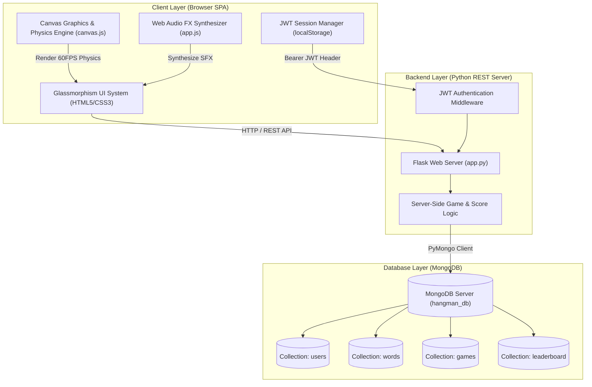

# 🎮 HANGMAN PRO - Enterprise Python & MongoDB Web Application

> A full-stack, next-generation **Hangman Web Application** built with a **Python REST Backend**, **MongoDB Database**, **JWT Authentication**, and an **Ultra-Realistic HTML5 Canvas Graphics Engine** featuring pendulum rope physics, joint ragdoll character dynamics, and Web Audio API synthesis.

---

## 🏗️ System Architecture



### High-Level Component Topology



---

## 🌟 Key Features

### 🔐 1. Enterprise Authentication & Security
- **JWT Authentication**: Stateless session tokens (`PyJWT`) with automatic token verification & expiration.
- **Bcrypt Hashing**: Secure salted password encryption (`bcrypt`).
- **Real-Time Password Strength Meter**: Evaluates character length, numbers, uppercase letters, and special symbols dynamically.
- **Anti-Cheat Server Architecture**: Secret words are strictly kept server-side in MongoDB; client receives masked strings (`_ A _ A _ _ I P T`).

### 🎨 2. Ultra-Realistic HTML5 Canvas Visual Engine
- **Wood Grain Gallows**: Rendered with timber grain textures, mortise joints, iron base brackets, and metallic bolts.
- **Pendulum Rope Physics**: Dynamic swinging rope loop with velocity dampening (`requestAnimationFrame`).
- **Ragdoll Character Physics**: Detailed 6-stage executioner model with facial expression shifts (Happy -> Worried -> Shocked -> Game Over Dead Eyes).
- **Particle FX**: Confetti fireworks particle burst on Victory; trapdoor drop release mechanism on Loss.

### 🔊 3. Zero-Dependency Web Audio API Sound Synthesizer
- Built-in Web Audio synthesizer generating real-time audio effects for key clicks, correct chime, wrong attempt thud, victory fanfare, and loss execution drop.

### 📊 4. MongoDB Persistent Analytics & Leaderboard
- **Categorized Word Collection**: Seeding script populates 6 categories (Programming & Tech, Movies & TV, Science & Nature, World History, Animals, Food & Culinary).
- **Global Leaderboard**: Tracks top players by High Score, Total Wins, and Streak.
- **Personal Statistics Dashboard**: Analytics modal with Win Rate %, total games played, and match history log.

---

## 📂 Project Structure

```
hangman_mongodb/
├── backend/
│   ├── app.py             # Flask Web Application & REST APIs
│   ├── db.py              # MongoDB PyMongo Driver & Index Setup
│   └── seed_words.py      # Database Seeder script for words collection
├── frontend/
│   ├── css/
│   │   └── styles.css     # Glassmorphism Dark Mode Architecture
│   ├── js/
│   │   ├── app.js         # REST API Client, Auth Manager, Audio Synthesizer
│   │   └── canvas.js      # Realistic HTML5 Canvas Physics Engine
│   └── index.html         # Single Page Application HTML Template
├── requirements.txt       # Python dependency manifest
└── README.md              # Documentation & Architecture specification
```

---

## 🚀 Quick Start & Installation

### Prerequisites
- **Python 3.10+** installed
- **MongoDB** running locally on port `27017` (or MongoDB Atlas URI)

### 1. Install Dependencies
```bash
pip install -r requirements.txt
```

### 2. Seed the MongoDB Database
Populate the `words` collection in MongoDB (`hangman_db`):
```bash
python backend/seed_words.py
```

### 3. Launch the Server
Start the Python backend server:
```bash
python backend/app.py
```

### 4. Access the Application
Open your browser and navigate to:
```
http://127.0.0.1:5000
```

---

## 📡 REST API Reference

### Authentication Endpoints
- `POST /api/auth/register` - Create a new user account (returns JWT token & profile).
- `POST /api/auth/login` - Authenticate user credentials (returns JWT token).
- `GET /api/auth/me` - Validate session token & return profile metrics.

### Gameplay Endpoints
- `POST /api/game/start` - Initialize a new game session with masked secret word.
- `POST /api/game/guess` - Submit letter guess, calculate score, return stage & status.
- `POST /api/game/hint` - Fetch word hint from MongoDB (applies small score penalty).

### Leaderboard & Stats Endpoints
- `GET /api/leaderboard` - Fetch Top 10 global players ordered by high score.
- `GET /api/stats` - Fetch personal game history & win/loss analytics.

---

## 🛠️ Environment Configuration
Optional environment variables can be set in a `.env` file:
```env
MONGO_URI=mongodb://localhost:27017/
DB_NAME=hangman_db
JWT_SECRET=super-secret-hangman-key-2026
PORT=5000
```
